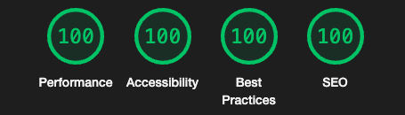

# Stephen Quinn Howard - Portfolio Site
Welcome to my portfolio site code base. Please let me know if you find anything I can improve upon!

## Technologies Used
- [Next.js](https://nextjs.org)
- [React.js](https://reactjs.org/)
- [Typescript](https://www.typescriptlang.org/)
- [TailwindCSS](https://tailwindcss.com)
- [Vercel](https://vercel.com)

## Credit
This site is bootstrapped according to the [init.tips](https://init.tips) stack, also known as the T3-Stack.
- [create-t3-app docs](https://create.t3.gg)

Curve & Wavy styling curteousy of [Shape Divider App](shapedivider.app).
Note: Some artifacts that show in Chrome dev tools for the mobile layout are a bug with Chrome dev tools and do not show on mobile.

## Lighthouse Scorecard

## Roadmap
- Add Portfolio Item cover photos with hover-transitions (First take wasn't responsive for mobile)
- Consider having Navbar fixed while scrolling
- Consider collapsible Navbar on mobile
- Consider To Top button on Footer (with smooth scrolling)
